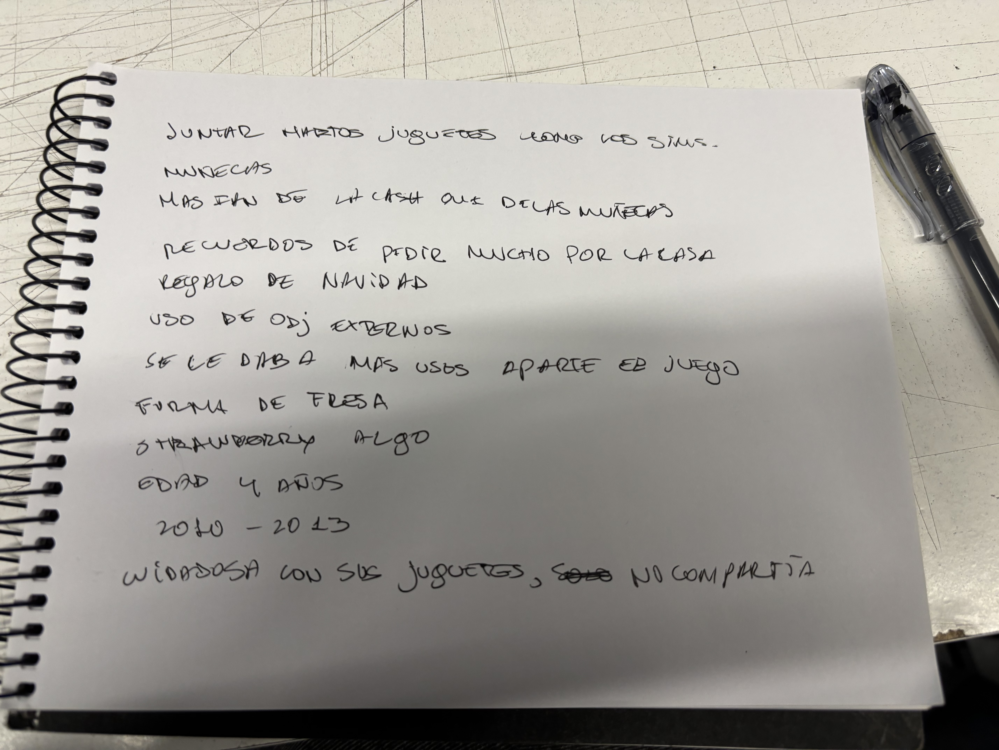
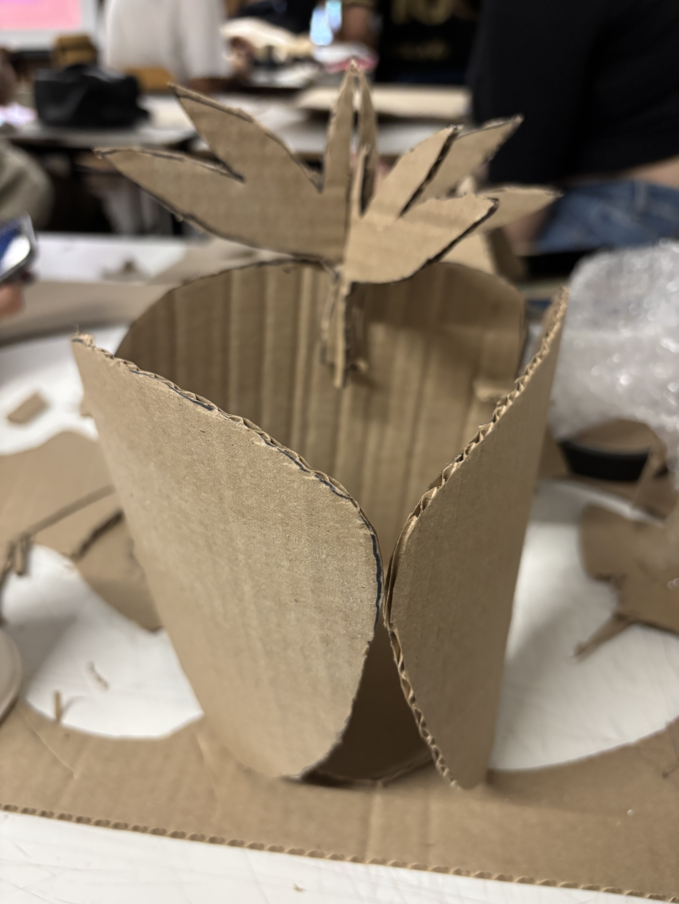
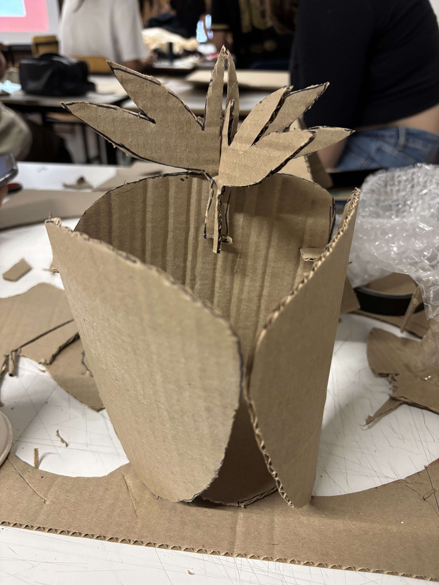
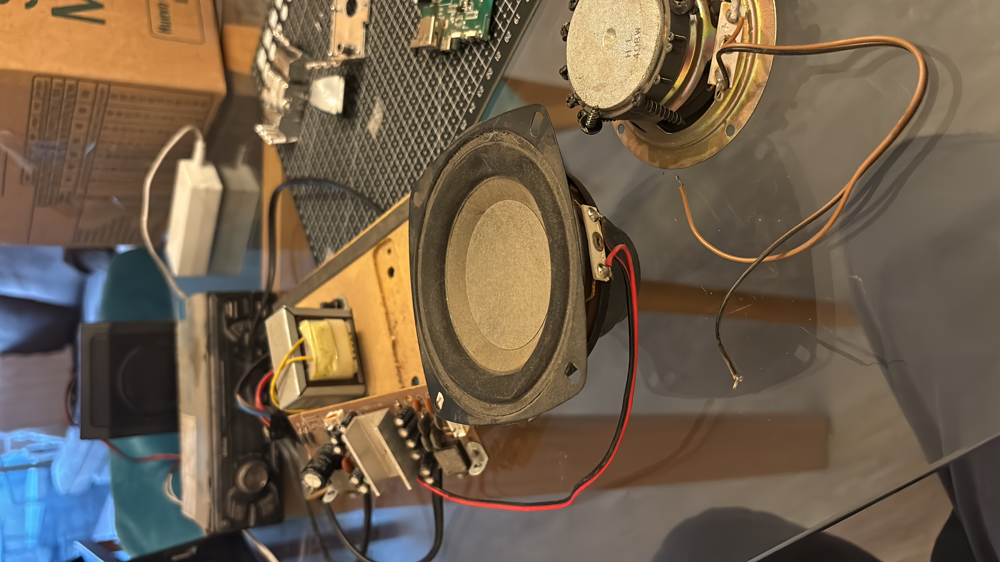
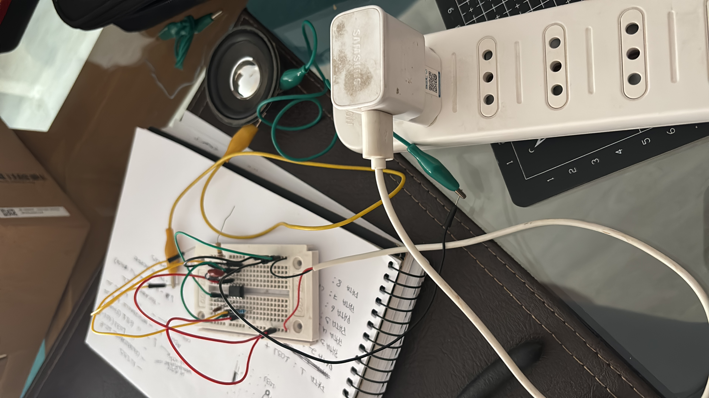
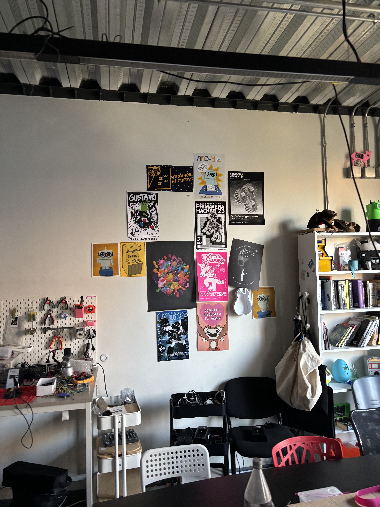
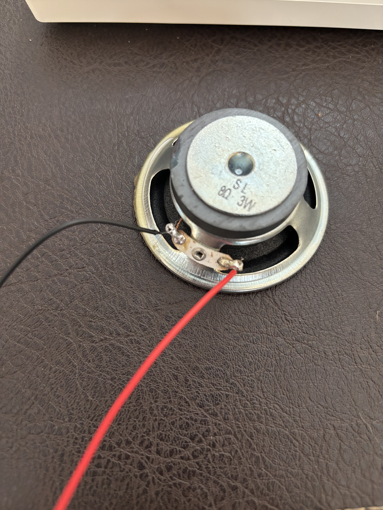

# Bitácora Taller 3

### Lunes 9 de Marzo
--(primer día)

---
### Jueves 12 de Marzo
Nos encargaron para este día realizar un mapa mental individual acerca de nosotros, sin saber mucho acerca de qué hablar, conté un poco acerca de mis gustos y hobbies, explicando un poco de manera implícita la manera en la que trabajaba mi mente.
Al final de cada presentación las profesoras iban anotando las cualidades de cada uno de nosotros, con el fin de armar grupos para los trabajos que se vienen después.
También nos encargaron ver la serie "Bauhaus: una nueva era" y redactar un ensayo acerca de un tema/concepto abordado en la serie que nos haya llamado la atención.

---
### Lunes 16 de Marzo
La primera parte de la clase consistió en comentar acerca de la serie, cosas que nos hayan gustado o simplemente cosas que nos hayan llamado la atención.
Después nos hicieron una breve presentación acerca de el estudio de usuarios, en el contexto del diseño enfocado en la experiencia del usuario. Nos hablaron de dos formas de estudio: mediante la observación (directa/indirecta) y mediante entrevistas y sus diversos tipos de éstas. También hablaron de los mapas de empatía, que funcionan como una herramienta visual más que nada para tener toda la información sobre el tipo de usuario ordenada.

Para la segunda parte de la clase, nos juntaron en duplas para entrevistarnos entre nosotros para intentar descrubrir el juguete de la otra persona.
mi juguete era un auto a control remoto y el de mi compañera Camila, era una casa de muñecas, con forma de frutilla.

Luego a partir de las respuestas que tuve, debía construir una maqueta de lo que yo me imaginaba que era su juguete (la casa de muñecas), lo que resultó en una frutilla masomenos,, pero por lo menos se acercaba a lo que era la verdadera casita.

 

También nos presentaron "drawdio", adelantándonos un poco acerca de cómo proseguiría nuestro proyecto.

---
### Jueves 19 de Marzo
Nos encargaron traer materiales para un segundo prototipo del juguete, al final no los usamos pero tuvimos el tiempo para poder bocetear mejoras para el juguete. También se nos sumó Fernando al grupo por lo que tuvimos la oportunidad de compartir aún más ideas gracias a que nos habló de su juguete de la infancia.

**[foto bocetos juguete]**

Ya finalizando la clase nos encargaron los materiales para la clase siguente, sumado a los componentes necesarios para la construcción del drawdio, mediante una protoboard.

---
### Lunes 23 de Marzo
Desastroso, no logramos coordinarnos como curso durante el finde para comprar los materiales por lo que atrasamos toda la clase, por otro lado, pude reciclar de placas de minicomponentes y de un amplificador de guitarra algunos materiales, aunque al llegar a la clase me percaté que se me habían quedado en la casa. Dado que la mitad del curso no tenía materiales y la otra mitad estaba esperando que abrieran la tienda para comprar, aproveché de devolverme a la casa a buscar mis cosas, aunque para cuando volví, las profesoras recurrieron al plan B que consistió en **NO SÉ NO ME ACUERDO**

Por otro lado, dediqué el finde a buscar componentes que podría reciclar para el sistema del drawdio, por lo que tuve que ir a la bodega a buscar placas de circuito de equipos que desarmé en algún momento del pasado y aunque no encontré mucho, me sirvió para masterizar el arte de des-soldar componentes de las placas.

**[foto placas circuitos]**

---
### Jueves 26 de Marzo

-- (falté) PERO logré construir el drawdio, aunque me hacía falta una batería de 9v, pero de manera **muy** casera pude solucionarlo, conectándolo a la fuente de poder del cargador de un teléfono viejo, que justo entregaba 9v.

---
### Lunes 30 de Marzo

Para la sesión de hoy llegamos para proponer ideas de cómo integrar el sistema del drawdio en el juguete, y aunque nuestro circuito estaba funcional, sonaba muy despacio, por lo que a recomendación de la profe, tuve que soldar los cables a la bocina y también reemplazar uno de los capacitores del circuito, lo que me dió la oportunidad de visitar por primera vez el lab de interacción digital!!! muy bueno.

 

La segunda mitad de la clase nos dedicamos a soltar ideas sobre cómo integrar el drawdio al juguete, pasando de que sonara al mover el auto, a transformar el auto-frutilla en una especie de juguete mensajero, haciendo que al momento de ingresar un mensaje en el juguete, gatille el sistema haciendo que se prendan luces led (dando a entender que hay un mensaje no leído), parecido a como funcionaban los buzones de voz de los teléfonos fijos, pero con un toque análogo al ser el mensaje escrito a mano.

**[foto bocetos juguetedrawdio]**

---
---
### 9 de abril

se nos encargó para hoy ir al museo/centro que nos correspondiese que en nuestro caso fue el Centro Cultural Matucana 100 (ubicado en av. matucana 100, je) para estudiar brevemente el lugar, la gente que concurre el lugar, el tipo de interacciones que ocurren, entre otras cosas que pudiesemos analizar referidas al estudio de usuario.

(notas de la salida a terreno)

se entra por av matucana y se encuentra frente a la biblioteca de santiago

estructuralmente se divide en distintos edificios, como el restaurant, el teatro y una galería que se usa para exposiciones de arte

apenas se entra, se encuentra una caseta de guardias e información, y tiene a plena vista unos trípticos informativos donde muestran un cronograma de las actividades que se realizan durante el mes.
también contiene una boletería donde se pueden comprar entradas para cine o teatro

la sala de cine se encuentra al lado de la entrada

a las afueras del centro, hay un gran mural hecho de azulejos, que te acompaña hacia la entrada

justo para el día y hora que vinimos, no habían actividades, asi que la única gente que pudimos ver fueron trabajadores,,
guardias y el resto no sé qué harán pero llevan camisetas negras que en la espalda dicen "M100"
también entró un señor preguntando acerca de la sala de cine, donde harán una exposición de danza a las 19:00

llegó un grupo medianamente grande de gente, a sacar fotos
pareciera que fueran un curso de estudiantes en una salida a terreno
algunos llevaban libretas en la mano, como si fueran a botecear la estructura

hay gente soldando la estructura donde se instalan las luces para lo que pareciera ser un show en la explanada del centro (patio)

almacened, liceos y minimarkets a los alrededores
talleres de bicicletas
tiendas de repuestos para autos

---
### 13 de abril

hoy partimos la clase con un pequeño montaje del barrio yungay que consistía en la impresión de un mapa que cubriera todos los museos/centros que se nos encargaron, junto a imágenes (impresas aparte), trípticos y demases que hayamos rescatado del lugar.

[fotomapa]

respecto a nuestra salida, al momento que fuimos nos encontramos con que estaba cerrado y que recién abriría cerca de las 21:00, por lo que poco y nada pudimos rescatar respecto al encargo que teníamos.

<!-- aparte del montaje, la idea era que cada grupo pudiese ............ -->

---
### 16 de abril

Este día se puso bueno **BUENO**, nos pidieron al final de la clase pasada que descargaramos el IDE de arduino, por lo que la clase de hoy fue dedicada 100% a aprender a usar los arduinos.

[fotoarduino]

Una primera parte de la clase fue teórica y se dedicó a entender cómo se dispone el arduino y qué hace cada "cosito" que tiene la placa (puertos, pines).

La segunda parte fue la que me tuvo saltando en una pata porque pusimos a prueba la placa junto al programa (IDE). La profe nos compartió un documento donde mostraban distintos ejercicios junto al código que debía instalarse en el arduino para que funcionase. Ya hacia el final de la clase nos encargaron hacer otros ejercicios más del mismo documento, con el fin de que logremos usar alguno como inspiración de prototipo del dispositivo a realizar, en base al estudio de usuario que hicimos anteriormente.

---
### 20 de abril

De todos los ejercicios finalmente nos decidimos por uno que usaba una fotorresistencia que al momento de la ausencia de luz, se encendiera un LED, nos decidimos por ese debido a que una de las cosas que nos llamó la atención del lugar es la poca iluminación que hay en ciertas ubicaciones (como cerca de la huerta por ejemplo).
En otro momento de la clase la profe sugirió a cada grupo un ejercicio distinto, que quizás nos podría servir de inspiración para el proyecto "final", por lo que a nosotros nos recomendó el proyecto L.A.S.E.R. TAG del colectivo Graffiti Research Lab.

---
### 23 de abril

Hoy tocó que cada grupo llegara con el ejercicio realizado, y a pesar de unos contratiempos que tuvimos (olvidé el adaptador para conectar mi computador al proyector), logramos montar todo el sistema para mostrar el funcionamiento, luego mientras el resto de los grupos le mostraban sus ejercicios a las profesoras, nos dimos el tiempo para realizar la lámina y tirar unas primeras ideas del ppt para el día de la solemne.

---
### 27 de abril

Para hoy deberíamos haber ido al M100 para poder instalar todo el sistema y dejarlo a disposición de la gente que esté ahí para que dibuje con el láser en los muros del galpón, aunque no pudimos ir porque aún no teníamos confirmación del centro sobre si nos autorizaban ir o no, y también estábamos con la idea de que el sistema lo iríamos a implementar con un mini-proyector, que el jueves la profesora nos ofreció prestarnos para hoy, así que las únicas opciones eran probar el sistema hoy o mañana.

Aunque para nuestra suerte, la profesora dejó su proyector en la casa (mea culpa, le recordamos muy tarde), por lo que me dió la opción de ir a buscarlo a la fac. de artes de la Finis Terrae, así que procedí a viajar por cielo mar y tierra (metro república hasta metro inés de suárez) para recuperar el tesoro y poder volver a las preciosas islas de la FaAAD.

A pesar de que no pudimos ir al M100 para probar el sistema, usamos el tiempo de clase para planificar el resto de las cosas que debe tener la presentación, y planificar también el fin e implementación del proyecto del graffiti.